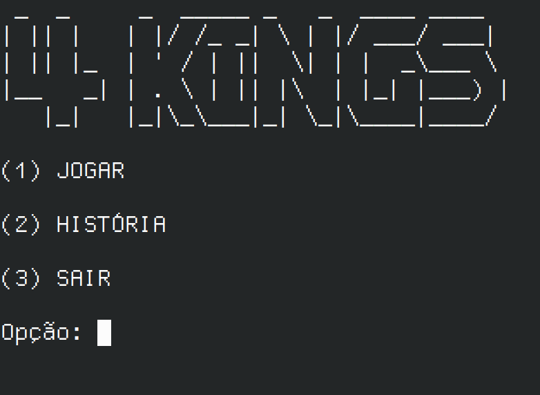

# 👑 4 Kings

4 Kings é um envolvente jogo de decisões que se desenrola no terminal. Como o novo Imperador dos Quatro Reinos, você enfrentará dilemas políticos, desafios morais e ameaças ancestrais que moldarão o destino de Campus Magnus. Tome decisões estratégicas, forje alianças, e enfrente as consequências dinâmicas de suas escolhas enquanto lidera os reinos de Inveractus, Aridum Glacies, Flachland e Fliegender Fluss. A ascensão ou queda dos reinos está nas pontas dos seus dedos. O que será registrado na história de 4 Kings depende exclusivamente das suas decisões.



# 📦  Como baixar o jogo

1. Primeiramente tenha java instalado.

2. Baixe o zip mais rencente na releases.

<a href="https://github.com/WilkerSebastian/4kings/releases/download/v1.0.0/4kings.zip">https://github.com/WilkerSebastian/4kings/releases/download/v1.0.0/4kings.zip</a>

4. Extraia a pasta do zip

```bash
unzip ./4Kings.zip
```

5.  Entre na pasta extradia e veja como rodar o jogo

```bash
cd ./4Kings
```

# 🎮 Como rodar jogo

1. Execute o jar com comando

```bash
java -jar ./4Kings.jar
```